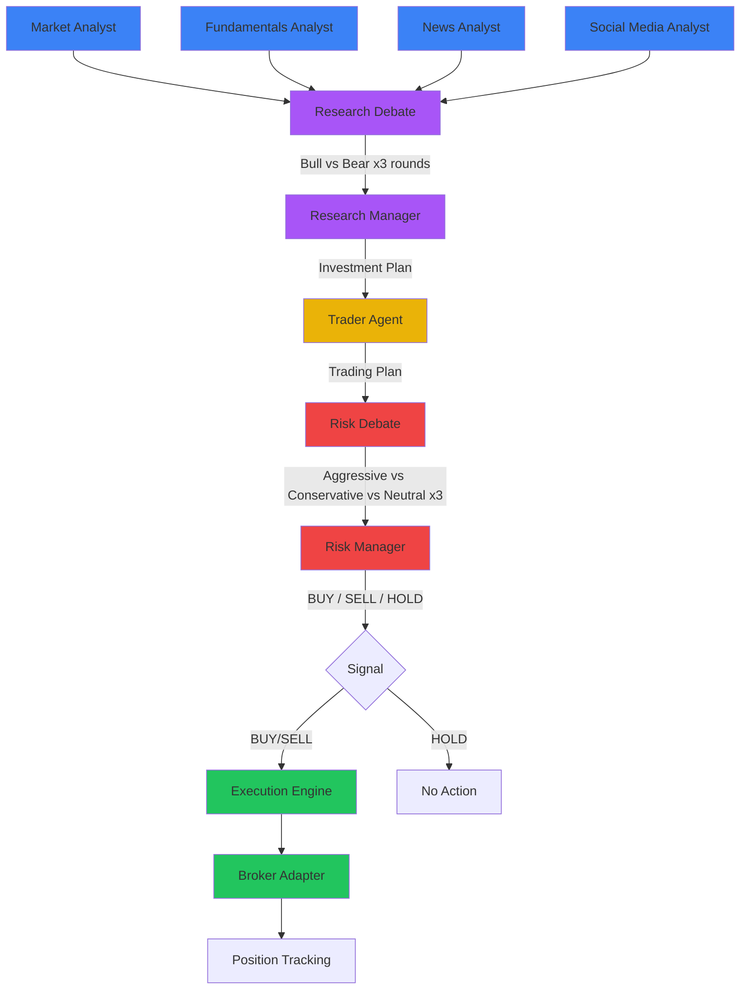

# Project Dashboard

## Architecture Decisions

```dataview
TABLE status, date, deciders
FROM "adr"
WHERE type != "folder"
SORT file.name ASC
```

## Design Documents

```dataview
TABLE type, tags
FROM "design"
WHERE file.name != "index"
SORT file.folder ASC, file.name ASC
```

## Research Notes by Category

```dataview
TABLE length(file.outlinks) AS "Links Out", length(file.inlinks) AS "Links In"
FROM "research"
WHERE file.name != "index" AND file.name != "cited-papers"
GROUP BY file.folder
```

## Agent System Overview

| Agent                                         | Phase           | LLM Tier   | Implementation                                             |
| --------------------------------------------- | --------------- | ---------- | ---------------------------------------------------------- |
| [[analyst-agents\|Market Analyst]]            | Analysis        | QuickThink | `internal/agent/analysts/market.go`                        |
| [[analyst-agents\|Fundamentals Analyst]]      | Analysis        | QuickThink | `internal/agent/analysts/fundamentals.go`                  |
| [[analyst-agents\|News Analyst]]              | Analysis        | QuickThink | `internal/agent/analysts/news.go`                          |
| [[analyst-agents\|Social Media Analyst]]      | Analysis        | QuickThink | `internal/agent/analysts/social.go`                        |
| [[research-debate-system\|Bull Researcher]]   | Research Debate | DeepThink  | `internal/agent/debate/bull_researcher.go`                 |
| [[research-debate-system\|Bear Researcher]]   | Research Debate | DeepThink  | `internal/agent/debate/bear_researcher.go`                 |
| [[research-debate-system\|Research Manager]]  | Research Debate | DeepThink  | `internal/agent/debate/research_manager.go`                |
| [[trader-agent\|Trader]]                      | Trading         | DeepThink  | `internal/agent/trader/trader.go`                          |
| [[risk-management-agents\|Risk Analysts (3)]] | Risk Debate     | DeepThink  | `internal/agent/risk/{aggressive,conservative,neutral}.go` |
| [[risk-management-agents\|Risk Manager]]      | Risk Debate     | DeepThink  | `internal/agent/risk/risk_manager.go`                      |

## Pipeline Flow



## Technology Stack

| Layer               | Technology                                | Purpose                             |
| ------------------- | ----------------------------------------- | ----------------------------------- |
| Backend             | Go 1.24                                   | Agent orchestration, API, execution |
| Frontend            | React 19 + Vite + TypeScript              | Dashboard, visualization            |
| Database            | PostgreSQL 17                             | All persistence, FTS memory         |
| Cache               | Redis 7                                   | Hot data, WebSocket fan-out         |
| LLM                 | OpenAI, Anthropic, Google, Ollama         | Agent reasoning                     |
| Broker (Stocks)     | Alpaca                                    | US equity execution                 |
| Broker (Crypto)     | Binance                                   | Crypto execution                    |
| Broker (Prediction) | Polymarket                                | Prediction market execution         |
| Data                | Polygon.io, Alpha Vantage, Yahoo, NewsAPI | Market data                         |
| Monitoring          | Prometheus + Grafana                      | Metrics and dashboards              |
| CI/CD               | GitHub Actions                            | Build, test, deploy                 |

## Quick Links

- [[executive-summary|Executive Summary]]
- [[system-architecture|System Architecture]]
- [[database-schema|Database Schema]]
- [[api-design|API Design]]
- [[implementation-roadmap|Implementation Roadmap]]
- [[agent-execution-guide|Agent Execution Guide]]
- [[paper-tracker|Paper Tracker]]
