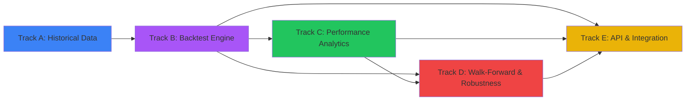

# Phase 4: Execution Paths

> 25 issues across 5 tracks. **6 ready now**, 19 blocked by dependencies.
> Updated: 2026-03-25
> Tracking issue: [#292](https://github.com/PatrickFanella/get-rich-quick/issues/292)

## Summary

| Track | Name                      | Total  | Ready | Blocked | Models          |
| ----- | ------------------------- | :----: | :---: | :-----: | --------------- |
| A     | Historical Data Infra     |   4    |   4   |    0    | GPT-5.4         |
| B     | Backtest Engine Core      |   7    |   0   |    7    | Mixed           |
| C     | Performance Analytics     |   5    |   0   |    5    | GPT-5.3-Codex   |
| D     | Walk-Forward & Robustness |   4    |   0   |    4    | Claude Opus 4.6 |
| E     | API & Integration         |   5    |   2   |    3    | GPT-5.4         |
|       | **Total**                 | **25** | **6** | **19**  |                 |

---

## Track A: Historical Data Infrastructure

> Depends on: Nothing (fully independent)

| #   | Title                                                     | Size | Blocker | Status  | Model           |
| --- | --------------------------------------------------------- | :--: | ------- | ------- | --------------- |
| 1   | Implement historical data loader with bulk OHLCV download |  M   | None    | READY   | GPT-5.4         |
| 2   | Implement historical data cache with date-range indexing  |  S   | #1      | BLOCKED | GPT-5.4         |
| 3   | Build historical news/sentiment snapshot loader           |  M   | None    | READY   | GPT-5.4         |
| 4   | Implement data replay iterator with look-ahead prevention |  M   | #1      | BLOCKED | Claude Opus 4.6 |

**Sequential start:** #1 first (or #1 and #3 in parallel), then #2 and #4.

---

## Track B: Backtest Engine Core

> Depends on: Track A (#4 data replay iterator)

| #   | Title                                                                   | Size | Blocker | Status  | Model           |
| --- | ----------------------------------------------------------------------- | :--: | ------- | ------- | --------------- |
| 1   | Implement backtest clock with simulated wall-clock                      |  S   | A#4     | BLOCKED | GPT-5.4         |
| 2   | Implement simulated order fill engine (slippage, spread, partial fills) |  L   | B#1     | BLOCKED | Claude Opus 4.6 |
| 3   | Build backtest broker adapter implementing existing Broker interface    |  M   | B#2     | BLOCKED | GPT-5.4         |
| 4   | Implement backtest pipeline runner with historical data context         |  L   | B#3     | BLOCKED | Claude Opus 4.6 |
| 5   | Build LLM response cache (prompt hash + model version keying)           |  M   | None    | BLOCKED | GPT-5.4         |
| 6   | Implement backtest position and P&L tracker with equity curve           |  M   | B#2     | BLOCKED | GPT-5.4         |
| 7   | Build backtest orchestrator (strategy + date range + params → results)  |  L   | B#4,B#6 | BLOCKED | Claude Opus 4.6 |

**Execution order:** B#1 → B#2 → B#3, B#6 (parallel) → B#4 → B#7. B#5 can start anytime.

---

## Track C: Performance Analytics

> Depends on: Track B (#6 position tracker, #7 orchestrator)

| #   | Title                                                                      | Size | Blocker | Status  | Model         |
| --- | -------------------------------------------------------------------------- | :--: | ------- | ------- | ------------- |
| 1   | Implement core metrics: Sharpe, Sortino, max drawdown, Calmar, win rate    |  M   | B#7     | BLOCKED | GPT-5.3-Codex |
| 2   | Implement trade analytics: holding periods, frequency, consecutive streaks |  S   | B#7     | BLOCKED | GPT-5.3-Codex |
| 3   | Build equity curve generator with drawdown overlay                         |  S   | B#6     | BLOCKED | GPT-5.4       |
| 4   | Implement benchmark comparison: alpha/beta against buy-and-hold            |  S   | C#1     | BLOCKED | GPT-5.3-Codex |
| 5   | Build backtest report generator: structured summary with all analytics     |  M   | C#1-C#4 | BLOCKED | GPT-5.4       |

**Execution order:** C#1, C#2, C#3 in parallel → C#4 → C#5.

---

## Track D: Walk-Forward & Robustness

> Depends on: Track B (#7 orchestrator) + Track C (#1 metrics)

| #   | Title                                                               | Size | Blocker | Status  | Model           |
| --- | ------------------------------------------------------------------- | :--: | ------- | ------- | --------------- |
| 1   | Implement walk-forward analysis with rolling calibrate/test windows |  L   | B#7,C#1 | BLOCKED | Claude Opus 4.6 |
| 2   | Build multi-run aggregator for non-determinism quantification       |  M   | B#7     | BLOCKED | Claude Opus 4.6 |
| 3   | Implement prompt versioning integration for A/B comparison          |  S   | D#2     | BLOCKED | GPT-5.4         |
| 4   | Build strategy comparison runner with side-by-side metrics          |  M   | C#1     | BLOCKED | GPT-5.4         |

**Execution order:** D#1, D#2 in parallel → D#3 → D#4.

---

## Track E: API & Integration

> Depends on: Tracks B-D for full functionality; repos can start early.

| #   | Title                                                                    | Size | Blocker | Status  | Model           |
| --- | ------------------------------------------------------------------------ | :--: | ------- | ------- | --------------- |
| 1   | Implement backtest configuration repository (CRUD)                       |  M   | None    | READY   | GPT-5.4         |
| 2   | Build backtest run repository (results, metrics, trade logs)             |  M   | None    | READY   | GPT-5.4         |
| 3   | Wire backtest orchestrator into scheduler for cron-triggered runs        |  S   | B#7     | BLOCKED | GPT-5.4         |
| 4   | Implement end-to-end integration test: data → pipeline → fills → metrics |  L   | All     | BLOCKED | Claude Opus 4.6 |
| 5   | Build backtest comparison API: query and compare historical run results  |  S   | E#2,D#4 | BLOCKED | GPT-5.4         |

**Sequential start:** E#1, E#2 (parallel, ready now) → E#3 → E#5 → E#4 last.

---

## Cross-Track Dependencies

---

## Key Design Principles

### Same Execution Engine

Reuse existing `Broker` interface, `Pipeline`, risk engine, and order management. The only new adapter is a simulated broker filling against historical prices. Backtest behavior must match live trading.

### LLM Cost Control

Each pipeline invocation costs $10-40 in inference fees. The LLM response cache (keyed by prompt hash + model version) prevents redundant calls during parameter sweeps. Log cache hit rates per run.

### Look-Ahead Prevention

The data replay iterator and backtest clock enforce strict temporal ordering. The pipeline only receives data with timestamps <= current simulated time. No future data leaks.

### Non-Determinism Mitigation

LLM outputs vary even at temperature 0. The multi-run aggregator runs each configuration 3+ times and reports mean +/- std for all metrics. Treat single-run results with skepticism.

### Transaction Cost Realism

Model commissions, bid-ask spreads, and exchange-specific fees. The simulated fill engine supports configurable slippage models (fixed, proportional, volatility-scaled).

---

## Model Selection Guide

| Task type                            | Recommended model | Why                                        |
| ------------------------------------ | ----------------- | ------------------------------------------ |
| Backtest orchestration, walk-forward | Claude Opus 4.6   | Complex control flow, temporal consistency |
| Simulated fill engine                | Claude Opus 4.6   | Financial logic, edge cases, partial fills |
| HTTP clients, data loaders           | GPT-5.4           | Straightforward API integration            |
| Performance metrics (math)           | GPT-5.3-Codex     | Algorithm-focused, precise computation     |
| Repository CRUD, cache wiring        | GPT-5.4           | Follows established patterns               |
| Prompt versioning, comparison API    | GPT-5.4           | Standard patterns, well-scoped             |
| E2E integration test                 | Claude Opus 4.6   | Multi-component orchestration              |

---

## Recommended Assignment Order

### Wave 1 (start now — 4 parallel, all independent)

| Title                             | Track    | Model   |
| --------------------------------- | -------- | ------- |
| Historical data loader            | A - Data | GPT-5.4 |
| Historical news/sentiment loader  | A - Data | GPT-5.4 |
| Backtest configuration repository | E - API  | GPT-5.4 |
| Backtest run repository           | E - API  | GPT-5.4 |

### Wave 2 (after wave 1)

| Title                 | Track      | Model           | Unblocked by |
| --------------------- | ---------- | --------------- | ------------ |
| Historical data cache | A - Data   | GPT-5.4         | A#1          |
| Data replay iterator  | A - Data   | Claude Opus 4.6 | A#1          |
| LLM response cache    | B - Engine | GPT-5.4         | —            |

### Wave 3 (after wave 2)

| Title                 | Track      | Model           | Unblocked by |
| --------------------- | ---------- | --------------- | ------------ |
| Backtest clock        | B - Engine | GPT-5.4         | A#4          |
| Simulated fill engine | B - Engine | Claude Opus 4.6 | B#1          |

### Wave 4 (after wave 3)

| Title                   | Track         | Model   | Unblocked by |
| ----------------------- | ------------- | ------- | ------------ |
| Backtest broker adapter | B - Engine    | GPT-5.4 | B#2          |
| Backtest P&L tracker    | B - Engine    | GPT-5.4 | B#2          |
| Equity curve generator  | C - Analytics | GPT-5.4 | B#6          |

### Wave 5 (after wave 4)

| Title                    | Track          | Model           | Unblocked by |
| ------------------------ | -------------- | --------------- | ------------ |
| Backtest pipeline runner | B - Engine     | Claude Opus 4.6 | B#3          |
| Core performance metrics | C - Analytics  | GPT-5.3-Codex   | B#7          |
| Trade analytics          | C - Analytics  | GPT-5.3-Codex   | B#7          |
| Multi-run aggregator     | D - Robustness | Claude Opus 4.6 | B#7          |

### Wave 6 (after wave 5)

| Title                         | Track          | Model           | Unblocked by |
| ----------------------------- | -------------- | --------------- | ------------ |
| Backtest orchestrator         | B - Engine     | Claude Opus 4.6 | B#4, B#6     |
| Benchmark comparison          | C - Analytics  | GPT-5.3-Codex   | C#1          |
| Walk-forward analysis         | D - Robustness | Claude Opus 4.6 | B#7, C#1     |
| Strategy comparison runner    | D - Robustness | GPT-5.4         | C#1          |
| Prompt versioning integration | D - Robustness | GPT-5.4         | D#2          |

### Wave 7 (after wave 6)

| Title                       | Track         | Model           | Unblocked by |
| --------------------------- | ------------- | --------------- | ------------ |
| Backtest report generator   | C - Analytics | GPT-5.4         | C#1-C#4      |
| Scheduler integration       | E - API       | GPT-5.4         | B#7          |
| Comparison API              | E - API       | GPT-5.4         | E#2, D#4     |
| End-to-end integration test | E - API       | Claude Opus 4.6 | All          |
