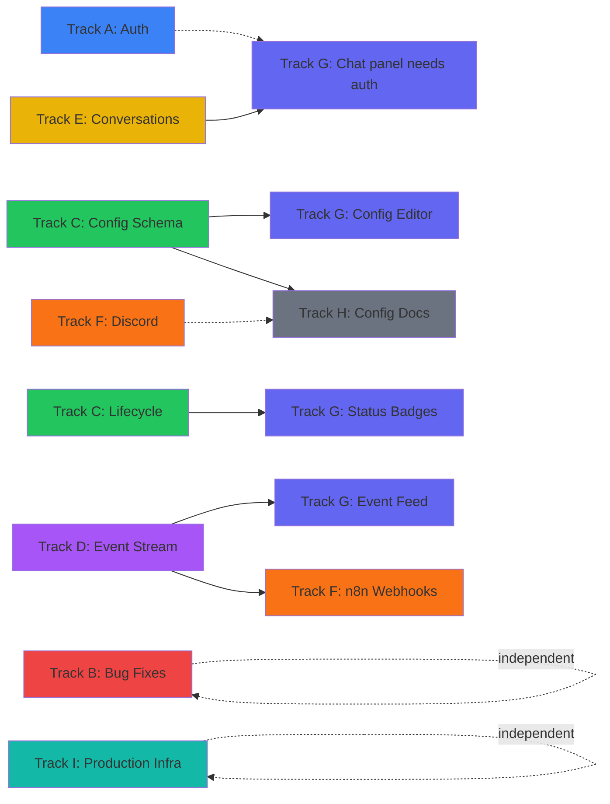

# Phase 7: Execution Paths

> 95 sub-issues across 9 tracks (21 epics). **34 ready now**, 61 blocked by dependencies.
> Updated: 2026-03-30
> Tracking issue: [#391](https://github.com/PatrickFanella/get-rich-quick/issues/391)

## Summary

| Track | Name                               | Epics            | Total  | Ready  | Blocked | Notes                          |
| ----- | ---------------------------------- | ---------------- | :----: | :----: | :-----: | ------------------------------ |
| A     | Authentication                     | #392             |   7    |   2    |    5    | Login flow end-to-end          |
| B     | Bug Fixes                          | #393, #394       |   7    |   4    |    3    | Trade fix + null-safety        |
| C     | Strategy Configuration & Lifecycle | #395, #396       |   10   |   3    |    7    | Config schema + pause/skip     |
| D     | Observability                      | #397, #398, #399 |   16   |   5    |   11    | Prompts, events, snapshots     |
| E     | Agent Conversations                | #400             |   6    |   1    |    5    | Conversation backend API       |
| F     | Notifications                      | #401, #402       |   8    |   2    |    6    | Discord + n8n webhooks         |
| G     | Frontend Pages                     | #403–#407        |   20   |   5    |   15    | Runs, risk, feed, chat, config |
| H     | Documentation                      | #408, #409, #410 |   14   |   9    |    5    | Docs rewrite + guides          |
| I     | Production Infrastructure          | #411, #412       |   7    |   4    |    3    | Docker + logging/shutdown      |
|       | **Total**                          |                  | **95** | **34** | **61**  |                                |

---

## Track A: Authentication

> Epic: [#392](https://github.com/PatrickFanella/get-rich-quick/issues/392) — Auth: login flow end-to-end
> Depends on: Nothing (fully independent start); frontend issues depend on backend

| #   | Issue                                                               | Title                                                                 | Size | Blocker | Status  |
| --- | ------------------------------------------------------------------- | --------------------------------------------------------------------- | :--: | ------- | ------- |
| 1   | [#413](https://github.com/PatrickFanella/get-rich-quick/issues/413) | Auth: Create users table migration                                    |  XS  | None    | READY   |
| 2   | [#414](https://github.com/PatrickFanella/get-rich-quick/issues/414) | Auth: Implement user repository interface and Postgres implementation |  M   | #413    | BLOCKED |
| 3   | [#415](https://github.com/PatrickFanella/get-rich-quick/issues/415) | Auth: Implement POST /api/v1/auth/login endpoint                      |  M   | #414    | BLOCKED |
| 4   | [#417](https://github.com/PatrickFanella/get-rich-quick/issues/417) | Auth: Implement POST /api/v1/auth/refresh endpoint                    |  S   | #415    | BLOCKED |
| 5   | [#419](https://github.com/PatrickFanella/get-rich-quick/issues/419) | Auth: Create frontend login page component                            |  M   | #415    | BLOCKED |
| 6   | [#422](https://github.com/PatrickFanella/get-rich-quick/issues/422) | Auth: Implement frontend token management and auto-refresh            |  M   | #419    | BLOCKED |
| 7   | [#425](https://github.com/PatrickFanella/get-rich-quick/issues/425) | Auth: Add auth route guards to frontend                               |  S   | None    | READY   |

**Execution order:** #413 -> #414 -> #415 -> #417, #419 (parallel) -> #422. #425 can start anytime.

---

## Track B: Bug Fixes

> Epic: [#393](https://github.com/PatrickFanella/get-rich-quick/issues/393) — Fix: trade history returns empty without filters
> Epic: [#394](https://github.com/PatrickFanella/get-rich-quick/issues/394) — Fix: null-safe list responses across all frontend pages
> Depends on: Nothing (fully independent)

### Epic #393: Trade History Fix

| #   | Issue                                                               | Title                                                  | Size | Blocker | Status  |
| --- | ------------------------------------------------------------------- | ------------------------------------------------------ | :--: | ------- | ------- |
| 1   | [#428](https://github.com/PatrickFanella/get-rich-quick/issues/428) | Trades: Add general List method to trades repository   |  S   | None    | READY   |
| 2   | [#432](https://github.com/PatrickFanella/get-rich-quick/issues/432) | Trades: Update handleListTrades to use general List    |  S   | #428    | BLOCKED |
| 3   | [#435](https://github.com/PatrickFanella/get-rich-quick/issues/435) | Trades: Verify trade history renders on portfolio page |  XS  | #432    | BLOCKED |

### Epic #394: Null-Safety Fix

| #   | Issue                                                               | Title                                                             | Size | Blocker | Status  |
| --- | ------------------------------------------------------------------- | ----------------------------------------------------------------- | :--: | ------- | ------- |
| 1   | [#453](https://github.com/PatrickFanella/get-rich-quick/issues/453) | Null-safe: Add defensive null guard to ApiClient response parsing |  S   | None    | READY   |
| 2   | [#439](https://github.com/PatrickFanella/get-rich-quick/issues/439) | Null-safe: Audit and fix null data arrays on strategies page      |  S   | #453    | BLOCKED |
| 3   | [#443](https://github.com/PatrickFanella/get-rich-quick/issues/443) | Null-safe: Audit and fix null data arrays on portfolio page       |  S   | None    | READY   |
| 4   | [#447](https://github.com/PatrickFanella/get-rich-quick/issues/447) | Null-safe: Audit and fix null data arrays on all remaining pages  |  S   | #439    | BLOCKED |

**Execution order:** #428 -> #432 -> #435 (trade fix chain). #453 -> #439 -> #447 (null-safety chain). #443 independent.

---

## Track C: Strategy Configuration & Lifecycle

> Epic: [#395](https://github.com/PatrickFanella/get-rich-quick/issues/395) — Strategy config: typed schema with fallback chain
> Epic: [#396](https://github.com/PatrickFanella/get-rich-quick/issues/396) — Strategy lifecycle: pause/resume/skip-next
> Depends on: Nothing for schema definition; lifecycle depends on schema

### Epic #395: Strategy Config Schema

| #   | Issue                                                               | Title                                                    | Size | Blocker | Status  |
| --- | ------------------------------------------------------------------- | -------------------------------------------------------- | :--: | ------- | ------- |
| 1   | [#416](https://github.com/PatrickFanella/get-rich-quick/issues/416) | Define StrategyConfig Go struct with all typed fields    |  M   | None    | READY   |
| 2   | [#420](https://github.com/PatrickFanella/get-rich-quick/issues/420) | Implement config resolution chain with fallback defaults |  M   | #416    | BLOCKED |
| 3   | [#423](https://github.com/PatrickFanella/get-rich-quick/issues/423) | Update strategy API validation to use StrategyConfig     |  S   | #420    | BLOCKED |
| 4   | [#430](https://github.com/PatrickFanella/get-rich-quick/issues/430) | Wire resolved config into pipeline execution             |  M   | #420    | BLOCKED |
| 5   | [#434](https://github.com/PatrickFanella/get-rich-quick/issues/434) | Add config resolution tests for edge cases               |  S   | #420    | BLOCKED |

### Epic #396: Strategy Lifecycle

| #   | Issue                                                               | Title                                                             | Size | Blocker | Status  |
| --- | ------------------------------------------------------------------- | ----------------------------------------------------------------- | :--: | ------- | ------- |
| 1   | [#418](https://github.com/PatrickFanella/get-rich-quick/issues/418) | Create migration for strategy status column                       |  XS  | None    | READY   |
| 2   | [#426](https://github.com/PatrickFanella/get-rich-quick/issues/426) | Update domain.Strategy struct and repository for status lifecycle |  M   | #418    | BLOCKED |
| 3   | [#438](https://github.com/PatrickFanella/get-rich-quick/issues/438) | Implement pause/resume/skip-next API endpoints                    |  M   | #426    | BLOCKED |
| 4   | [#444](https://github.com/PatrickFanella/get-rich-quick/issues/444) | Update scheduler to respect strategy status and skip flag         |  S   | #438    | BLOCKED |
| 5   | [#449](https://github.com/PatrickFanella/get-rich-quick/issues/449) | Add strategy status badges and action buttons to frontend         |  M   | #438    | BLOCKED |

**Execution order:** #416 -> #420 -> #423, #430, #434 (parallel). #418 -> #426 -> #438 -> #444, #449 (parallel).

---

## Track D: Observability

> Epic: [#397](https://github.com/PatrickFanella/get-rich-quick/issues/397) — Observability: prompt recording + cost tracking
> Epic: [#398](https://github.com/PatrickFanella/get-rich-quick/issues/398) — Observability: agent event stream
> Epic: [#399](https://github.com/PatrickFanella/get-rich-quick/issues/399) — Observability: market data snapshots + phase timings
> Depends on: Nothing for migrations; API endpoints depend on repository layers

### Epic #397: Prompt Recording + Cost Tracking

| #   | Issue                                                               | Title                                                               | Size | Blocker | Status  |
| --- | ------------------------------------------------------------------- | ------------------------------------------------------------------- | :--: | ------- | ------- |
| 1   | [#421](https://github.com/PatrickFanella/get-rich-quick/issues/421) | Create migration adding prompt_text and cost_usd to agent_decisions |  XS  | None    | READY   |
| 2   | [#433](https://github.com/PatrickFanella/get-rich-quick/issues/433) | Capture prompt text in pipeline LLM calls                           |  M   | #421    | BLOCKED |
| 3   | [#437](https://github.com/PatrickFanella/get-rich-quick/issues/437) | Capture LLM cost in pipeline calls                                  |  M   | #433    | BLOCKED |
| 4   | [#446](https://github.com/PatrickFanella/get-rich-quick/issues/446) | Expose prompt_text and cost_usd in API responses                    |  S   | #437    | BLOCKED |

### Epic #398: Agent Event Stream

| #   | Issue                                                               | Title                                 | Size | Blocker | Status  |
| --- | ------------------------------------------------------------------- | ------------------------------------- | :--: | ------- | ------- |
| 1   | [#424](https://github.com/PatrickFanella/get-rich-quick/issues/424) | Create agent_events table migration   |  XS  | None    | READY   |
| 2   | [#440](https://github.com/PatrickFanella/get-rich-quick/issues/440) | Implement agent events repository     |  M   | #424    | BLOCKED |
| 3   | [#452](https://github.com/PatrickFanella/get-rich-quick/issues/452) | Emit events from pipeline execution   |  M   | #440    | BLOCKED |
| 4   | [#462](https://github.com/PatrickFanella/get-rich-quick/issues/462) | Implement GET /api/v1/events endpoint |  S   | #440    | BLOCKED |
| 5   | [#466](https://github.com/PatrickFanella/get-rich-quick/issues/466) | Emit events for order lifecycle       |  M   | #440    | BLOCKED |

### Epic #399: Market Data Snapshots + Phase Timings

| #   | Issue                                                               | Title                                                 | Size | Blocker | Status  |
| --- | ------------------------------------------------------------------- | ----------------------------------------------------- | :--: | ------- | ------- |
| 1   | [#427](https://github.com/PatrickFanella/get-rich-quick/issues/427) | Create pipeline_run_snapshots table migration         |  XS  | None    | READY   |
| 2   | [#429](https://github.com/PatrickFanella/get-rich-quick/issues/429) | Add phase_timings column to pipeline_runs             |  XS  | None    | READY   |
| 3   | [#442](https://github.com/PatrickFanella/get-rich-quick/issues/442) | Implement pipeline run snapshots repository           |  M   | #427    | BLOCKED |
| 4   | [#456](https://github.com/PatrickFanella/get-rich-quick/issues/456) | Store market data snapshots during pipeline execution |  M   | #442    | BLOCKED |
| 5   | [#460](https://github.com/PatrickFanella/get-rich-quick/issues/460) | Record phase timings during pipeline execution        |  M   | #429    | BLOCKED |
| 6   | [#471](https://github.com/PatrickFanella/get-rich-quick/issues/471) | Implement GET /api/v1/runs/:id/snapshot endpoint      |  S   | #442    | BLOCKED |
| 7   | [#474](https://github.com/PatrickFanella/get-rich-quick/issues/474) | Include phase_timings in pipeline run API responses   |  S   | #460    | BLOCKED |

**Execution order:** Migrations (#421, #424, #427, #429) are all independent and ready. Repositories (#433, #440, #442) follow. Pipeline integration (#452, #456, #460, #466) and API endpoints (#446, #462, #471, #474) come last.

---

## Track E: Agent Conversations

> Epic: [#400](https://github.com/PatrickFanella/get-rich-quick/issues/400) — Conversations: backend API
> Depends on: Nothing for migration; endpoints depend on repository

| #   | Issue                                                               | Title                                                          | Size | Blocker | Status  |
| --- | ------------------------------------------------------------------- | -------------------------------------------------------------- | :--: | ------- | ------- |
| 1   | [#431](https://github.com/PatrickFanella/get-rich-quick/issues/431) | Create conversations and conversation_messages table migration |  XS  | None    | READY   |
| 2   | [#436](https://github.com/PatrickFanella/get-rich-quick/issues/436) | Implement conversation repository                              |  M   | #431    | BLOCKED |
| 3   | [#441](https://github.com/PatrickFanella/get-rich-quick/issues/441) | Implement conversation context builder                         |  M   | #436    | BLOCKED |
| 4   | [#445](https://github.com/PatrickFanella/get-rich-quick/issues/445) | Implement POST /api/v1/conversations endpoint                  |  S   | #436    | BLOCKED |
| 5   | [#450](https://github.com/PatrickFanella/get-rich-quick/issues/450) | Implement POST /api/v1/conversations/:id/messages endpoint     |  S   | #441    | BLOCKED |
| 6   | [#454](https://github.com/PatrickFanella/get-rich-quick/issues/454) | Implement GET conversations and GET messages endpoints         |  S   | #436    | BLOCKED |

**Execution order:** #431 -> #436 -> #441, #445, #454 (parallel) -> #450.

---

## Track F: Notifications

> Epic: [#401](https://github.com/PatrickFanella/get-rich-quick/issues/401) — Discord notifier
> Epic: [#402](https://github.com/PatrickFanella/get-rich-quick/issues/402) — n8n webhook integration
> Depends on: Nothing for webhook client; embeds and wiring depend on client; n8n depends on event stream (Track D)

### Epic #401: Discord Notifier

| #   | Issue                                                               | Title                                           | Size | Blocker | Status  |
| --- | ------------------------------------------------------------------- | ----------------------------------------------- | :--: | ------- | ------- |
| 1   | [#458](https://github.com/PatrickFanella/get-rich-quick/issues/458) | Implement Discord webhook client                |  M   | None    | READY   |
| 2   | [#461](https://github.com/PatrickFanella/get-rich-quick/issues/461) | Implement signal embed formatting for Discord   |  S   | #458    | BLOCKED |
| 3   | [#464](https://github.com/PatrickFanella/get-rich-quick/issues/464) | Implement decision embed formatting for Discord |  S   | #458    | BLOCKED |
| 4   | [#468](https://github.com/PatrickFanella/get-rich-quick/issues/468) | Implement alert embed formatting for Discord    |  S   | #458    | BLOCKED |
| 5   | [#476](https://github.com/PatrickFanella/get-rich-quick/issues/476) | Wire Discord notifier into alert manager        |  S   | #468    | BLOCKED |

### Epic #402: n8n Webhook Integration

| #   | Issue                                                               | Title                                             | Size | Blocker | Status  |
| --- | ------------------------------------------------------------------- | ------------------------------------------------- | :--: | ------- | ------- |
| 1   | [#481](https://github.com/PatrickFanella/get-rich-quick/issues/481) | Define structured webhook payload schema          |  S   | None    | READY   |
| 2   | [#484](https://github.com/PatrickFanella/get-rich-quick/issues/484) | Update webhook notifier to use structured payload |  S   | #481    | BLOCKED |
| 3   | [#487](https://github.com/PatrickFanella/get-rich-quick/issues/487) | Add n8n webhook URL config field                  |  XS  | #484    | BLOCKED |

**Execution order:** #458 -> #461, #464, #468 (parallel) -> #476. #481 -> #484 -> #487. Both chains independent.

---

## Track G: Frontend Pages

> Epic: [#403](https://github.com/PatrickFanella/get-rich-quick/issues/403) — Frontend: runs list page
> Epic: [#404](https://github.com/PatrickFanella/get-rich-quick/issues/404) — Frontend: risk dashboard page
> Epic: [#405](https://github.com/PatrickFanella/get-rich-quick/issues/405) — Frontend: realtime event feed panel
> Epic: [#406](https://github.com/PatrickFanella/get-rich-quick/issues/406) — Frontend: realtime chat panel
> Epic: [#407](https://github.com/PatrickFanella/get-rich-quick/issues/407) — Strategy config: frontend editor
> Depends on: Various backend APIs from Tracks C, D, E

### Epic #403: Runs List Page

| #   | Issue                                                               | Title                                                          | Size | Blocker | Status  |
| --- | ------------------------------------------------------------------- | -------------------------------------------------------------- | :--: | ------- | ------- |
| 1   | [#448](https://github.com/PatrickFanella/get-rich-quick/issues/448) | Frontend: RunsPage component with paginated table              |  M   | None    | READY   |
| 2   | [#463](https://github.com/PatrickFanella/get-rich-quick/issues/463) | Frontend: filter bar for runs page                             |  S   | #448    | BLOCKED |
| 3   | [#465](https://github.com/PatrickFanella/get-rich-quick/issues/465) | Frontend: click-through navigation from run row to detail page |  S   | #448    | BLOCKED |

### Epic #404: Risk Dashboard Page

| #   | Issue                                                               | Title                                                                | Size | Blocker | Status  |
| --- | ------------------------------------------------------------------- | -------------------------------------------------------------------- | :--: | ------- | ------- |
| 1   | [#451](https://github.com/PatrickFanella/get-rich-quick/issues/451) | Frontend: RiskPage layout with circuit breaker and kill switch cards |  M   | None    | READY   |
| 2   | [#455](https://github.com/PatrickFanella/get-rich-quick/issues/455) | Backend: implement GET /api/v1/audit-log endpoint                    |  M   | None    | READY   |
| 3   | [#469](https://github.com/PatrickFanella/get-rich-quick/issues/469) | Frontend: position limit utilization section on risk page            |  S   | #451    | BLOCKED |
| 4   | [#473](https://github.com/PatrickFanella/get-rich-quick/issues/473) | Frontend: audit log viewer section on risk page                      |  S   | #455    | BLOCKED |

### Epic #405: Realtime Event Feed Panel

| #   | Issue                                                               | Title                                            | Size | Blocker | Status  |
| --- | ------------------------------------------------------------------- | ------------------------------------------------ | :--: | ------- | ------- |
| 1   | [#457](https://github.com/PatrickFanella/get-rich-quick/issues/457) | Frontend: RealtimePage with two-panel layout     |  M   | None    | READY   |
| 2   | [#478](https://github.com/PatrickFanella/get-rich-quick/issues/478) | Frontend: live event feed in realtime left panel |  M   | #462    | BLOCKED |
| 3   | [#480](https://github.com/PatrickFanella/get-rich-quick/issues/480) | Frontend: clickable event cards with callback    |  S   | #478    | BLOCKED |

### Epic #406: Realtime Chat Panel

| #   | Issue                                                               | Title                                               | Size | Blocker   | Status  |
| --- | ------------------------------------------------------------------- | --------------------------------------------------- | :--: | --------- | ------- |
| 1   | [#459](https://github.com/PatrickFanella/get-rich-quick/issues/459) | Frontend: ChatPanel component with message display  |  M   | None      | READY   |
| 2   | [#485](https://github.com/PatrickFanella/get-rich-quick/issues/485) | Frontend: chat panel message input bar              |  S   | #459      | BLOCKED |
| 3   | [#486](https://github.com/PatrickFanella/get-rich-quick/issues/486) | Frontend: wire chat panel to conversation API       |  M   | #454      | BLOCKED |
| 4   | [#489](https://github.com/PatrickFanella/get-rich-quick/issues/489) | Frontend: click-event-to-chat flow                  |  M   | #480,#486 | BLOCKED |
| 5   | [#491](https://github.com/PatrickFanella/get-rich-quick/issues/491) | Frontend: conversation selector and history browser |  M   | #454      | BLOCKED |

### Epic #407: Strategy Config Frontend Editor

| #   | Issue                                                               | Title                                                            | Size | Blocker | Status  |
| --- | ------------------------------------------------------------------- | ---------------------------------------------------------------- | :--: | ------- | ------- |
| 1   | [#493](https://github.com/PatrickFanella/get-rich-quick/issues/493) | Frontend: LLM configuration fields on strategy form              |  M   | #423    | BLOCKED |
| 2   | [#496](https://github.com/PatrickFanella/get-rich-quick/issues/496) | Frontend: pipeline configuration fields on strategy form         |  M   | #423    | BLOCKED |
| 3   | [#498](https://github.com/PatrickFanella/get-rich-quick/issues/498) | Frontend: risk configuration fields on strategy form             |  M   | #423    | BLOCKED |
| 4   | [#499](https://github.com/PatrickFanella/get-rich-quick/issues/499) | Frontend: analyst selection checkboxes on strategy form          |  S   | #423    | BLOCKED |
| 5   | [#501](https://github.com/PatrickFanella/get-rich-quick/issues/501) | Frontend: advanced prompt overrides JSON editor on strategy form |  M   | #423    | BLOCKED |

**Execution order:** Runs (#448 -> #463, #465). Risk (#451, #455 parallel -> #469, #473). Realtime layout (#457) ready; event feed (#478) needs events API (#462); chat panel (#459 -> #485; #486 needs conversations API #454). Config editor (#493-#501) all blocked on strategy API validation (#423).

---

## Track H: Documentation

> Epic: [#408](https://github.com/PatrickFanella/get-rich-quick/issues/408) — Docs: delete stale reference docs + rewrite
> Epic: [#409](https://github.com/PatrickFanella/get-rich-quick/issues/409) — Docs: getting-started guide
> Epic: [#410](https://github.com/PatrickFanella/get-rich-quick/issues/410) — Docs: strategy config schema + notification setup
> Depends on: Nothing for doc deletion and most rewrites; notification docs depend on Tracks C and F being implemented

### Epic #408: Docs Rewrite

| #   | Issue                                                               | Title                                                   | Size | Blocker | Status  |
| --- | ------------------------------------------------------------------- | ------------------------------------------------------- | :--: | ------- | ------- |
| 1   | [#467](https://github.com/PatrickFanella/get-rich-quick/issues/467) | Delete all Python-referencing docs from docs/reference/ |  XS  | None    | READY   |
| 2   | [#470](https://github.com/PatrickFanella/get-rich-quick/issues/470) | Write Go architecture reference doc                     |  M   | #467    | BLOCKED |
| 3   | [#472](https://github.com/PatrickFanella/get-rich-quick/issues/472) | Write CLI commands reference doc                        |  S   | None    | READY   |
| 4   | [#475](https://github.com/PatrickFanella/get-rich-quick/issues/475) | Write API endpoints reference doc                       |  M   | None    | READY   |
| 5   | [#477](https://github.com/PatrickFanella/get-rich-quick/issues/477) | Write agent system reference doc                        |  M   | None    | READY   |
| 6   | [#479](https://github.com/PatrickFanella/get-rich-quick/issues/479) | Write data providers reference doc                      |  S   | None    | READY   |
| 7   | [#482](https://github.com/PatrickFanella/get-rich-quick/issues/482) | Write LLM configuration reference doc                   |  S   | None    | READY   |
| 8   | [#483](https://github.com/PatrickFanella/get-rich-quick/issues/483) | Update docs/design/api-design.md for Phase 5 endpoints  |  S   | None    | READY   |

### Epic #409: Getting-Started Guide

| #   | Issue                                                               | Title                                       | Size | Blocker | Status  |
| --- | ------------------------------------------------------------------- | ------------------------------------------- | :--: | ------- | ------- |
| 1   | [#488](https://github.com/PatrickFanella/get-rich-quick/issues/488) | Write getting-started prerequisites section |  S   | None    | READY   |
| 2   | [#490](https://github.com/PatrickFanella/get-rich-quick/issues/490) | Write setup and first-run guide             |  M   | #488    | BLOCKED |
| 3   | [#492](https://github.com/PatrickFanella/get-rich-quick/issues/492) | Write troubleshooting FAQ section           |  S   | #490    | BLOCKED |

### Epic #410: Config + Notification Docs

| #   | Issue                                                               | Title                                      | Size | Blocker | Status  |
| --- | ------------------------------------------------------------------- | ------------------------------------------ | :--: | ------- | ------- |
| 1   | [#494](https://github.com/PatrickFanella/get-rich-quick/issues/494) | Write strategy config schema documentation |  M   | #416    | BLOCKED |
| 2   | [#495](https://github.com/PatrickFanella/get-rich-quick/issues/495) | Write Discord webhook setup guide          |  S   | #458    | BLOCKED |
| 3   | [#497](https://github.com/PatrickFanella/get-rich-quick/issues/497) | Write n8n integration guide                |  S   | #481    | BLOCKED |

**Execution order:** #467 first (delete stale docs), then #470. Remaining docs (#472-#483) mostly independent and ready. Getting-started: #488 -> #490 -> #492. Config/notification docs depend on implementation landing.

---

## Track I: Production Infrastructure

> Epic: [#411](https://github.com/PatrickFanella/get-rich-quick/issues/411) — Production: Docker build + compose
> Epic: [#412](https://github.com/PatrickFanella/get-rich-quick/issues/412) — Production: structured logging + graceful shutdown
> Depends on: Nothing for Dockerfile and slog config; E2E test depends on compose

### Epic #411: Docker Build + Compose

| #   | Issue                                                               | Title                                    | Size | Blocker | Status  |
| --- | ------------------------------------------------------------------- | ---------------------------------------- | :--: | ------- | ------- |
| 1   | [#500](https://github.com/PatrickFanella/get-rich-quick/issues/500) | Create multi-stage production Dockerfile |  M   | None    | READY   |
| 2   | [#502](https://github.com/PatrickFanella/get-rich-quick/issues/502) | Create docker-compose.prod.yml           |  S   | #500    | BLOCKED |
| 3   | [#503](https://github.com/PatrickFanella/get-rich-quick/issues/503) | Harden health check endpoint             |  S   | None    | READY   |
| 4   | [#504](https://github.com/PatrickFanella/get-rich-quick/issues/504) | Test production build end-to-end         |  M   | #502    | BLOCKED |

### Epic #412: Structured Logging + Graceful Shutdown

| #   | Issue                                                               | Title                                         | Size | Blocker | Status  |
| --- | ------------------------------------------------------------------- | --------------------------------------------- | :--: | ------- | ------- |
| 1   | [#505](https://github.com/PatrickFanella/get-rich-quick/issues/505) | Configure JSON slog handler for production    |  S   | None    | READY   |
| 2   | [#506](https://github.com/PatrickFanella/get-rich-quick/issues/506) | Verify graceful shutdown drains pipeline runs |  M   | None    | READY   |
| 3   | [#507](https://github.com/PatrickFanella/get-rich-quick/issues/507) | Add shutdown timeout and logging              |  S   | #506    | BLOCKED |

**Execution order:** #500 -> #502 -> #504. #503 independent. #505 independent. #506 -> #507.

---

## Cross-Track Dependencies

---

## Recommended Wave Execution Plan

### Wave 1 — Migrations + independent foundations (18 issues, all independent)

Start all database migrations and independent leaf tasks. Zero blockers.

| Issue                                                               | Title                                                               | Track |
| ------------------------------------------------------------------- | ------------------------------------------------------------------- | ----- |
| [#413](https://github.com/PatrickFanella/get-rich-quick/issues/413) | Auth: Create users table migration                                  | A     |
| [#425](https://github.com/PatrickFanella/get-rich-quick/issues/425) | Auth: Add auth route guards to frontend                             | A     |
| [#428](https://github.com/PatrickFanella/get-rich-quick/issues/428) | Trades: Add general List method to trades repository                | B     |
| [#453](https://github.com/PatrickFanella/get-rich-quick/issues/453) | Null-safe: Add defensive null guard to ApiClient response parsing   | B     |
| [#443](https://github.com/PatrickFanella/get-rich-quick/issues/443) | Null-safe: Audit and fix null data arrays on portfolio page         | B     |
| [#416](https://github.com/PatrickFanella/get-rich-quick/issues/416) | Define StrategyConfig Go struct with all typed fields               | C     |
| [#418](https://github.com/PatrickFanella/get-rich-quick/issues/418) | Create migration for strategy status column                         | C     |
| [#421](https://github.com/PatrickFanella/get-rich-quick/issues/421) | Create migration adding prompt_text and cost_usd to agent_decisions | D     |
| [#424](https://github.com/PatrickFanella/get-rich-quick/issues/424) | Create agent_events table migration                                 | D     |
| [#427](https://github.com/PatrickFanella/get-rich-quick/issues/427) | Create pipeline_run_snapshots table migration                       | D     |
| [#429](https://github.com/PatrickFanella/get-rich-quick/issues/429) | Add phase_timings column to pipeline_runs                           | D     |
| [#431](https://github.com/PatrickFanella/get-rich-quick/issues/431) | Create conversations and conversation_messages table migration      | E     |
| [#458](https://github.com/PatrickFanella/get-rich-quick/issues/458) | Implement Discord webhook client                                    | F     |
| [#481](https://github.com/PatrickFanella/get-rich-quick/issues/481) | Define structured webhook payload schema                            | F     |
| [#467](https://github.com/PatrickFanella/get-rich-quick/issues/467) | Delete all Python-referencing docs from docs/reference/             | H     |
| [#500](https://github.com/PatrickFanella/get-rich-quick/issues/500) | Create multi-stage production Dockerfile                            | I     |
| [#503](https://github.com/PatrickFanella/get-rich-quick/issues/503) | Harden health check endpoint                                        | I     |
| [#505](https://github.com/PatrickFanella/get-rich-quick/issues/505) | Configure JSON slog handler for production                          | I     |

### Wave 2 — Repositories + core logic (18 issues)

Build repository layers on top of Wave 1 migrations. Start independent docs.

| Issue                                                               | Title                                                             | Track | Unblocked by |
| ------------------------------------------------------------------- | ----------------------------------------------------------------- | ----- | ------------ |
| [#414](https://github.com/PatrickFanella/get-rich-quick/issues/414) | Auth: Implement user repository                                   | A     | #413         |
| [#432](https://github.com/PatrickFanella/get-rich-quick/issues/432) | Trades: Update handleListTrades to use general List               | B     | #428         |
| [#439](https://github.com/PatrickFanella/get-rich-quick/issues/439) | Null-safe: strategies page                                        | B     | #453         |
| [#420](https://github.com/PatrickFanella/get-rich-quick/issues/420) | Implement config resolution chain with fallback defaults          | C     | #416         |
| [#426](https://github.com/PatrickFanella/get-rich-quick/issues/426) | Update domain.Strategy struct and repository for status lifecycle | C     | #418         |
| [#433](https://github.com/PatrickFanella/get-rich-quick/issues/433) | Capture prompt text in pipeline LLM calls                         | D     | #421         |
| [#440](https://github.com/PatrickFanella/get-rich-quick/issues/440) | Implement agent events repository                                 | D     | #424         |
| [#442](https://github.com/PatrickFanella/get-rich-quick/issues/442) | Implement pipeline run snapshots repository                       | D     | #427         |
| [#460](https://github.com/PatrickFanella/get-rich-quick/issues/460) | Record phase timings during pipeline execution                    | D     | #429         |
| [#436](https://github.com/PatrickFanella/get-rich-quick/issues/436) | Implement conversation repository                                 | E     | #431         |
| [#461](https://github.com/PatrickFanella/get-rich-quick/issues/461) | Implement signal embed formatting for Discord                     | F     | #458         |
| [#464](https://github.com/PatrickFanella/get-rich-quick/issues/464) | Implement decision embed formatting for Discord                   | F     | #458         |
| [#468](https://github.com/PatrickFanella/get-rich-quick/issues/468) | Implement alert embed formatting for Discord                      | F     | #458         |
| [#484](https://github.com/PatrickFanella/get-rich-quick/issues/484) | Update webhook notifier to use structured payload                 | F     | #481         |
| [#470](https://github.com/PatrickFanella/get-rich-quick/issues/470) | Write Go architecture reference doc                               | H     | #467         |
| [#502](https://github.com/PatrickFanella/get-rich-quick/issues/502) | Create docker-compose.prod.yml                                    | I     | #500         |
| [#506](https://github.com/PatrickFanella/get-rich-quick/issues/506) | Verify graceful shutdown drains pipeline runs                     | I     | --           |
| [#488](https://github.com/PatrickFanella/get-rich-quick/issues/488) | Write getting-started prerequisites section                       | H     | --           |

### Wave 3 — API endpoints + pipeline integration (20 issues)

Wire repositories into HTTP endpoints and pipeline execution. Start frontend shells.

| Issue                                                               | Title                                                  | Track | Unblocked by |
| ------------------------------------------------------------------- | ------------------------------------------------------ | ----- | ------------ |
| [#415](https://github.com/PatrickFanella/get-rich-quick/issues/415) | Auth: Implement POST /api/v1/auth/login endpoint       | A     | #414         |
| [#435](https://github.com/PatrickFanella/get-rich-quick/issues/435) | Trades: Verify trade history renders on portfolio page | B     | #432         |
| [#447](https://github.com/PatrickFanella/get-rich-quick/issues/447) | Null-safe: all remaining pages                         | B     | #439         |
| [#423](https://github.com/PatrickFanella/get-rich-quick/issues/423) | Update strategy API validation to use StrategyConfig   | C     | #420         |
| [#430](https://github.com/PatrickFanella/get-rich-quick/issues/430) | Wire resolved config into pipeline execution           | C     | #420         |
| [#434](https://github.com/PatrickFanella/get-rich-quick/issues/434) | Add config resolution tests for edge cases             | C     | #420         |
| [#438](https://github.com/PatrickFanella/get-rich-quick/issues/438) | Implement pause/resume/skip-next API endpoints         | C     | #426         |
| [#437](https://github.com/PatrickFanella/get-rich-quick/issues/437) | Capture LLM cost in pipeline calls                     | D     | #433         |
| [#452](https://github.com/PatrickFanella/get-rich-quick/issues/452) | Emit events from pipeline execution                    | D     | #440         |
| [#462](https://github.com/PatrickFanella/get-rich-quick/issues/462) | Implement GET /api/v1/events endpoint                  | D     | #440         |
| [#466](https://github.com/PatrickFanella/get-rich-quick/issues/466) | Emit events for order lifecycle                        | D     | #440         |
| [#456](https://github.com/PatrickFanella/get-rich-quick/issues/456) | Store market data snapshots during pipeline execution  | D     | #442         |
| [#471](https://github.com/PatrickFanella/get-rich-quick/issues/471) | Implement GET /api/v1/runs/:id/snapshot endpoint       | D     | #442         |
| [#474](https://github.com/PatrickFanella/get-rich-quick/issues/474) | Include phase_timings in pipeline run API responses    | D     | #460         |
| [#441](https://github.com/PatrickFanella/get-rich-quick/issues/441) | Implement conversation context builder                 | E     | #436         |
| [#445](https://github.com/PatrickFanella/get-rich-quick/issues/445) | Implement POST /api/v1/conversations endpoint          | E     | #436         |
| [#454](https://github.com/PatrickFanella/get-rich-quick/issues/454) | Implement GET conversations and GET messages endpoints | E     | #436         |
| [#476](https://github.com/PatrickFanella/get-rich-quick/issues/476) | Wire Discord notifier into alert manager               | F     | #468         |
| [#487](https://github.com/PatrickFanella/get-rich-quick/issues/487) | Add n8n webhook URL config field                       | F     | #484         |
| [#507](https://github.com/PatrickFanella/get-rich-quick/issues/507) | Add shutdown timeout and logging                       | I     | #506         |

### Wave 4 — Frontend pages + remaining endpoints (16 issues)

Build frontend pages that consume the APIs from Wave 3.

| Issue                                                               | Title                                                      | Track | Unblocked by |
| ------------------------------------------------------------------- | ---------------------------------------------------------- | ----- | ------------ |
| [#417](https://github.com/PatrickFanella/get-rich-quick/issues/417) | Auth: Implement POST /api/v1/auth/refresh endpoint         | A     | #415         |
| [#419](https://github.com/PatrickFanella/get-rich-quick/issues/419) | Auth: Create frontend login page component                 | A     | #415         |
| [#446](https://github.com/PatrickFanella/get-rich-quick/issues/446) | Expose prompt_text and cost_usd in API responses           | D     | #437         |
| [#444](https://github.com/PatrickFanella/get-rich-quick/issues/444) | Update scheduler to respect strategy status and skip flag  | C     | #438         |
| [#449](https://github.com/PatrickFanella/get-rich-quick/issues/449) | Add strategy status badges and action buttons to frontend  | C     | #438         |
| [#450](https://github.com/PatrickFanella/get-rich-quick/issues/450) | Implement POST /api/v1/conversations/:id/messages endpoint | E     | #441         |
| [#448](https://github.com/PatrickFanella/get-rich-quick/issues/448) | Frontend: RunsPage component with paginated table          | G     | --           |
| [#451](https://github.com/PatrickFanella/get-rich-quick/issues/451) | Frontend: RiskPage layout with circuit breaker cards       | G     | --           |
| [#455](https://github.com/PatrickFanella/get-rich-quick/issues/455) | Backend: implement GET /api/v1/audit-log endpoint          | G     | --           |
| [#457](https://github.com/PatrickFanella/get-rich-quick/issues/457) | Frontend: RealtimePage with two-panel layout               | G     | --           |
| [#459](https://github.com/PatrickFanella/get-rich-quick/issues/459) | Frontend: ChatPanel component with message display         | G     | --           |
| [#478](https://github.com/PatrickFanella/get-rich-quick/issues/478) | Frontend: live event feed in realtime left panel           | G     | #462         |
| [#486](https://github.com/PatrickFanella/get-rich-quick/issues/486) | Frontend: wire chat panel to conversation API              | G     | #454         |
| [#491](https://github.com/PatrickFanella/get-rich-quick/issues/491) | Frontend: conversation selector and history browser        | G     | #454         |
| [#490](https://github.com/PatrickFanella/get-rich-quick/issues/490) | Write setup and first-run guide                            | H     | #488         |
| [#504](https://github.com/PatrickFanella/get-rich-quick/issues/504) | Test production build end-to-end                           | I     | #502         |

### Wave 5 — Frontend refinements + config editor (15 issues)

Add filtering, drill-down, config editor forms, and remaining docs.

| Issue                                                               | Title                                                            | Track | Unblocked by |
| ------------------------------------------------------------------- | ---------------------------------------------------------------- | ----- | ------------ |
| [#422](https://github.com/PatrickFanella/get-rich-quick/issues/422) | Auth: Implement frontend token management and auto-refresh       | A     | #419         |
| [#463](https://github.com/PatrickFanella/get-rich-quick/issues/463) | Frontend: filter bar for runs page                               | G     | #448         |
| [#465](https://github.com/PatrickFanella/get-rich-quick/issues/465) | Frontend: click-through navigation from run row to detail page   | G     | #448         |
| [#469](https://github.com/PatrickFanella/get-rich-quick/issues/469) | Frontend: position limit utilization section on risk page        | G     | #451         |
| [#473](https://github.com/PatrickFanella/get-rich-quick/issues/473) | Frontend: audit log viewer section on risk page                  | G     | #455         |
| [#480](https://github.com/PatrickFanella/get-rich-quick/issues/480) | Frontend: clickable event cards with callback                    | G     | #478         |
| [#485](https://github.com/PatrickFanella/get-rich-quick/issues/485) | Frontend: chat panel message input bar                           | G     | #459         |
| [#493](https://github.com/PatrickFanella/get-rich-quick/issues/493) | Frontend: LLM configuration fields on strategy form              | G     | #423         |
| [#496](https://github.com/PatrickFanella/get-rich-quick/issues/496) | Frontend: pipeline configuration fields on strategy form         | G     | #423         |
| [#498](https://github.com/PatrickFanella/get-rich-quick/issues/498) | Frontend: risk configuration fields on strategy form             | G     | #423         |
| [#499](https://github.com/PatrickFanella/get-rich-quick/issues/499) | Frontend: analyst selection checkboxes on strategy form          | G     | #423         |
| [#501](https://github.com/PatrickFanella/get-rich-quick/issues/501) | Frontend: advanced prompt overrides JSON editor on strategy form | G     | #423         |
| [#494](https://github.com/PatrickFanella/get-rich-quick/issues/494) | Write strategy config schema documentation                       | H     | #416         |
| [#495](https://github.com/PatrickFanella/get-rich-quick/issues/495) | Write Discord webhook setup guide                                | H     | #458         |
| [#497](https://github.com/PatrickFanella/get-rich-quick/issues/497) | Write n8n integration guide                                      | H     | #481         |

### Wave 6 — Cross-feature integration (5 issues)

Wire together the event feed, chat, and conversation flows.

| Issue                                                               | Title                              | Track | Unblocked by |
| ------------------------------------------------------------------- | ---------------------------------- | ----- | ------------ |
| [#489](https://github.com/PatrickFanella/get-rich-quick/issues/489) | Frontend: click-event-to-chat flow | G     | #480, #486   |
| [#492](https://github.com/PatrickFanella/get-rich-quick/issues/492) | Write troubleshooting FAQ section  | H     | #490         |
| [#472](https://github.com/PatrickFanella/get-rich-quick/issues/472) | Write CLI commands reference doc   | H     | --           |
| [#475](https://github.com/PatrickFanella/get-rich-quick/issues/475) | Write API endpoints reference doc  | H     | --           |
| [#477](https://github.com/PatrickFanella/get-rich-quick/issues/477) | Write agent system reference doc   | H     | --           |

### Wave 7 — Final docs + polish (3 issues)

Remaining independent reference docs that can land anytime.

| Issue                                                               | Title                                                  | Track | Unblocked by |
| ------------------------------------------------------------------- | ------------------------------------------------------ | ----- | ------------ |
| [#479](https://github.com/PatrickFanella/get-rich-quick/issues/479) | Write data providers reference doc                     | H     | --           |
| [#482](https://github.com/PatrickFanella/get-rich-quick/issues/482) | Write LLM configuration reference doc                  | H     | --           |
| [#483](https://github.com/PatrickFanella/get-rich-quick/issues/483) | Update docs/design/api-design.md for Phase 5 endpoints | H     | --           |

---

## Key Design Principles

1. **Migrations first** -- All database schema changes (7 migrations in Wave 1) are independent and unblock the entire dependency graph. Ship them immediately.
2. **Repository layer before API layer** -- Each domain (events, snapshots, conversations) follows migration -> repository -> pipeline integration -> HTTP endpoint. This keeps each PR small and testable.
3. **Bug fixes are independent** -- Tracks A and B have zero cross-track dependencies. They can proceed in parallel with everything else.
4. **Config editor is blocked on validation** -- All 5 frontend config editor issues (#493-#501) are blocked on #423 (strategy API validation). Getting the config schema chain (#416 -> #420 -> #423) done early unblocks the entire Track G config editor epic.
5. **Event stream is the cross-track bottleneck** -- The realtime event feed (#478), clickable cards (#480), and click-to-chat flow (#489) all depend on the event stream pipeline (Track D #398). Prioritize #424 -> #440 -> #452 -> #462 to unblock the frontend.
6. **Documentation can run in parallel** -- 9 of 14 doc issues are ready now. Writers can start immediately without waiting for implementation.
