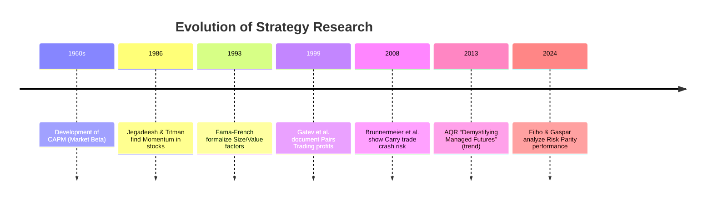

# Profitable Trading Strategies: Executive Summary  
We review major systematic trading approaches—trend-following (time‐series momentum), cross‐sectional momentum, mean-reversion (contrarian) strategies, factor‐based (value/quality) investing, statistical arbitrage (pairs trading), currency/bond carry trades, volatility selling, market-making, risk-parity, and CTA/managed futures. Each strategy exploits a distinct market inefficiency or risk premium and has unique implementation rules, horizons, and risk profiles. For example, trend-following (“time‐series momentum”) goes long (buy) assets with recent positive returns and short those with recent negative returns, targeting persistent trends【1†L143-L151】【6†L217-L224】. In contrast, cross-sectional momentum buys past winners (top decile of past returns) and shorts losers【12†L41-L49】, while contrarian strategies bet on short-term reversals. Carry trades invest in high-yielding currencies or bonds, collecting yield differentials as premia【19†L156-L164】【29†L307-L314】. Volatility‐selling (e.g. writing index puts) earns the volatility risk premium【27†L318-L327】. Market-making earns the bid-ask spread in liquid instruments【24†L17-L22】. Risk-parity allocates so each asset contributes equal risk, leveraging low-volatility assets【31†L39-L47】. 

Empirically, many of these strategies have delivered attractive returns historically.  A widely cited time-series momentum portfolio (equal-weight mix of 1-, 3-, and 12-month signals across global futures) produced an annualized **gross Sharpe ≈1.8**【60†L97-L104】 (≈0.7 after fees) from 1880–2016【1†L143-L151】.  Cross-sectional equity momentum (buying 6- or 12-month winners vs. losers) has earned roughly **1–1.5% per month** (∼12–18% per year) gross【15†L1-L4】.  Pairs trading (long–short cointegrated stock pairs) historically returned up to **~12% per annum** on well-selected pairs【22†L154-L162】.  Sell-side volatility (e.g. short at-the-money index puts) achieved much higher total returns (e.g. CBOE PutWrite up 1835% vs 708% for the S&P500 over 1986–2018)【27†L318-L327】.  Currency carry portfolios yielded ~5–7%/yr with Sharpe ~0.3【29†L307-L314】, but exhibit sharp negative skew【19†L156-L164】. Risk-parity portfolios have matched or modestly outperformed traditional 60/40 portfolios in recent decades【31†L39-L47】.  

**Comparative Strategy Table (attributes, horizon, markets, edge, cost sensitivity, key refs):**  

| Strategy (Category)                  | Time Horizon         | Instruments / Markets              | Primary Edge/Return Source             | Turnover / Cost Sensitivity     | Key References                                |
|--------------------------------------|----------------------|------------------------------------|----------------------------------------|---------------------------------|-----------------------------------------------|
| Trend-Following (Time-Series Momentum) | Weeks–Months         | Liquid futures (commodities, FX, bonds, equity indices) | Price continuation (investor anchoring, slow info)【6†L217-L224】 | Moderate (futures roll, fees)   |【1†L143-L151】【6†L217-L224】                  |
| Momentum (Cross-Sectional)           | 1–12 months          | Equities (global), FX, etc.        | Winner-loser continuation (underreaction)【12†L41-L49】 | High (monthly rebalancing)      |【12†L41-L49】【15†L1-L4】                      |
| Mean-Reversion (Contrarian)          | Days–Weeks (very short) | Equities, ETFs                   | Short-term price bounce (overreaction) | Very high (bid-ask, whipsaw risk) | *Classic anomaly literature (e.g. LeRoy 1989, Moskowitz & Grinblatt 1999)* |
| Pairs Trading (Statistical Arb.)     | Weeks–Months         | Cointegrated stocks or futures     | Relative value convergence             | High (two offsetting legs)      |【22†L154-L162】                              |
| Carry Strategies                     | Months–Years         | FX, government/corporate bonds     | Yield/roll-down premium               | Moderate (depends on instrument) |【19†L156-L164】【29†L307-L314】               |
| Volatility Selling (Carry)           | Days–Weeks           | Equity-index futures, options (VIX) | Implied > realized volatility (vol prem)【27†L318-L327】 | High (tail risk, margin)        |【27†L318-L327】                              |
| Market Making                        | Intraday–Seconds     | High-volume stocks, futures       | Capturing bid-ask spreads             | Low per trade (requires low latency) |【24†L17-L22】                               |
| Risk Parity                          | Years (rebal. monthly/quarterly) | Multi-asset (stocks, bonds, etc.) | Equal risk contribution, volatility targeting【31†L39-L47】 | Low (rebalancing costs moderate) |【31†L39-L47】                               |
| Factor Investing (Value/Quality, etc.) | Years (rebal. annually) | Equities (global, Fama-French universes) | Fundamental risk premia (e.g. value, profitability) | Low (long-term holding)        | *Fama–French factors* (e.g. Fama & French 1993; Novy-Marx 2013) |
| CTA / Managed Futures                | Weeks–Months         | Global futures (multi-asset)      | Multi-horizon trend-following (similar to above) | Moderate (fees, futures)       |【60†L97-L104】【1†L143-L151】               |

## Trend-Following (Time-Series Momentum)  
- **Category & Name:** Trend-following, also known as time-series momentum【1†L143-L151】.  
- **Mechanics:** Calculate each market’s past return over a look-back (e.g. 1, 3, or 12 months). If past return >0, go long; if <0, go short【58†L159-L168】. Apply risk sizing (e.g. volatility scaling) so each position targets equal risk【58†L165-L168】. Rebalance periodically (often monthly) to reflect updated trends. Common implementations combine multiple horizons (e.g. 1m/3m/12m signals) to capture short-, medium-, and long-term trends【58†L155-L164】.  
- **Principle:** Works because prices often **trend** due to behavioral biases (anchoring, herding) and institutional flows【6†L217-L224】.  Markets under-react to information, causing gradual price moves that momentum strategies capture. For example, Hurst *et al.* (2017) find trends present across diverse markets over more than a century【6†L217-L224】.  Trend-followers benefit especially in long bull/bear markets (persisting moves)【60†L97-L104】.  
- **Instruments & Horizon:** Typically futures or liquid FX/commodity/currency contracts (to allow shorting and leverage). Rebalances are often monthly, but some implementations trade weekly or daily (especially in indices or FX). Trend signals can be applied at any horizon; a common choice is 12-month look-back with 1-month holding. Shorter look-backs (e.g. 1–3 months) may capture faster trends, though performance is often lower【58†L155-L164】.  
- **Risks & Costs:** Trend strategies can suffer in sideways (non-trending) markets, leading to choppy returns. They may incur rollover costs in futures and moderate trading costs from monthly rebalancing【58†L177-L184】. Volatility scaling limits risk from any one market but can lead to rapid turnover if realized vol spikes. Trend-followers often experienced extended drawdowns around sudden market reversals or in crisis aftermaths【60†L97-L104】.   Transaction costs are non-negligible given the frequent trading of many markets. Implementation tips: ensure sufficiently liquid futures (narrow spreads), account for roll yields, and apply volatility/Risk-parity weighting to diversify.  
- **Performance & Evidence:** Numerous studies show strong long-run performance. For instance, Hurst *et al.* (2017) simulate a diversified trend system (using AQR’s parameters) over 1880–2016 and report a gross annualized return of ~18% (10% volatility)【1†L143-L151】【60†L97-L104】. After conservative cost estimates and typical 2%/20% fees, net returns were ~7%/yr (Sharpe ≈0.7)【60†L97-L104】. AQR (2013) likewise reports a diversified TS momentum Sharpe ≈1.8 gross (≈0.8–1.0 after costs)【60†L97-L104】.  Hurst *et al.* show positive trend performance in every decade since 1880【6†L217-L224】. The strategy’s correlation to stocks/bonds is near zero or negative, offering diversification. Notable variations include using alternate signal rules (moving-average crossovers, trend strength filters) and adjusting lookback/horizon to match instrument liquidity.  
- **References:** Hurst, Ooi, and Pedersen (2017) provide extensive evidence on trend-following【1†L143-L151】【6†L217-L224】. AQR (Hurst *et al.* 2013) “Demystifying Managed Futures” analyzes strategy design and CTA returns【60†L97-L104】.  

## Momentum (Cross-Sectional Momentum)  
- **Category & Name:** Cross-sectional momentum (also just “momentum”). Buying past winners and selling past losers based on relative performance.  
- **Mechanics:** Sort assets (e.g. stocks) by their recent total return over a formation period (commonly 3, 6, or 12 months). Go long the highest-return percentile (winners) and short the lowest (losers). Portfolios are typically formed monthly, sometimes skipping the most recent month to avoid short-term reversal effects. A classic implementation is the “6-1” strategy: rank stocks by 6-month return, skip 1-month, hold for 6 months. Jegadeesh & Titman (1993) used 3–12 month formation and held portfolios for up to 1 year【12†L41-L49】.  
- **Principle:** Driven by investor under-reaction to news and underpriced trends (and possibly risk factors). Momentum profits arise because information diffuses slowly: stocks that have done well (perhaps due to positive news) continue to outperform as more investors pile in. Momentum crashes can occur when mean-reversion kicks in (e.g. strongly after market troughs).  
- **Instruments & Horizon:** Most commonly applied to equities (U.S., international). Also documented in commodities, bonds, and currencies (see carry/momentum cross-asset work). Typical lookbacks: 6-12 months; holding periods: 3-12 months. FX and commodity momentum often use similar horizons【12†L41-L49】.  
- **Risks & Costs:** High turnover and portfolio churn lead to significant transaction costs. Momentum strategies can suffer sharp losses when market trends reverse abruptly (so-called “momentum crashes”). Short-side risks (e.g. shorting illiquid stocks) must be managed. Implementation often requires diversification (e.g. many small positions) and liquidity filters.  
- **Performance & Evidence:** Jegadeesh & Titman (1993) found U.S. equity momentum strategies (6-month formation) returned about **1–1.5% per month** gross【15†L1-L4】. These excess returns persisted after controlling for CAPM risk (market beta)【12†L41-L49】. International studies (Rouwenhorst 1998) confirm momentum abroad. More recent multi-asset work (Asness *et al.* 2013) finds momentum pervades across asset classes. Sharpe ratios before costs are often ~0.6–0.8; after costs/net of liquidity they fall (estimates vary ~0.3–0.5). Typical parameter choices are well studied: e.g. 6-month formation, 1-month skip, 6-month hold is a common rule【15†L1-L4】. Variations include “dual momentum” (combining trend and cross-sectional), volatility weighting, and multi-horizon signals.  
- **References:** See Jegadeesh & Titman (1993)【12†L41-L49】 for original momentum evidence. Asness, Moskowitz & Pedersen (2013) examine cross-asset momentum, and Pedersen *et al.* (2015) discuss risk scaling.  

## Mean-Reversion (Contrarian Strategies)  
- **Category:** Contrarian or mean-reversion strategies.  
- **Mechanics:** Unlike momentum, contrarian strategies buy assets that have recently underperformed and sell recent winners, betting on a price rebound. For example, one-week or one-month reversal strategies are known to yield profits in equity markets. Pairs trading (see below) is a form of relative mean-reversion. Long-horizon value investing (buy low price/earnings stocks) is also a mean-reversion factor.  
- **Principle:** Based on overreaction: market participants sometimes oversell or overbuy assets (e.g. panic selling), causing temporary mispricing. Prices then revert toward fundamentals. The classical result by De Bondt & Thaler (1985) shows large losers over 3–5 years outperform large winners subsequently, implying long-horizon reversal. Short-horizon reversals (days to weeks) have also been documented by Lehmann (1990) and others.  
- **Instruments & Horizon:** Primarily equities; can also occur in commodities or FX (short-term FX “reversals” after momentum). Horizons tend to be very short (daily or weekly) for the strongest reversals. Execution requires high liquidity due to rapid trades.  
- **Risks & Costs:** Extreme turnover and market friction. Carries risk of getting caught in a further decline (“value traps”). The profits are relatively small per trade, requiring leverage or high volume.  
- **Evidence:** Short-term reversal profits are well documented; e.g. many studies report a statistically significant profit for contrarian strategies over 1-week or 1-month horizons (often 0.5–2% per month gross). Long-term reversal (multi-year) evidence is weaker once risk factors are controlled. These strategies tend to have low Sharpe (≈0.3–0.5) after costs. Implementations usually include transaction cost filters and avoid extremely thin stocks.  
- **Variations:** Market-neutral “stat arb” versions include equity factor arbitrage, where multi-factor portfolios bet on reversal in sectors or asset groups. Careful risk management (stop losses) is crucial given potential for momentum surprises.  

## Pairs Trading (Statistical Arbitrage)  
- **Category:** Market-neutral/statistical arbitrage.  
- **Mechanics:** Identify pairs (or groups) of historically correlated or cointegrated instruments (e.g. two similar stocks). When their price spread widens beyond a threshold, sell the outperformer and buy the underperformer, betting on convergence. Positions are held until the spread normalizes. Portfolios are typically market-neutral. Trade signals and thresholds can be based on z-scores of the price spread.  
- **Principle:** Relies on mean reversion in the relative price of the pair (e.g. two stocks in the same industry usually move together). Structural reasons include shared fundamentals or index arbitrage. The strategy seeks small but consistent relative mispricings.  
- **Instruments & Horizon:** Commonly applied to equities (US or global), ADR–home price pairs, ETFs vs underlying, futures spreads (crack/spread trades), and even FX pairs. Holding periods vary; classic studies looked at monthly rebalancing over ~6 months【22†L154-L162】.  
- **Risks & Costs:** Tail risk if the relationship breaks down (pair decouples). Requires careful cointegration checks. High turnover if many pairs are traded; transaction costs can erode profits. Model risk (calibration of parameters) is significant. Out-of-sample degradation is a concern; many simple stat-arb signals become crowded and unprofitable once exploited.  
- **Performance & Evidence:** Gatev, Goetzmann & Rouwenhorst (2006) examine a simple pairs rule on US stocks (1962–1997) and report **~11–12% annualized excess returns** for top pairs【22†L154-L162】. They find Sharpe ratios 4–6× higher than the market, even after conservative cost estimates【22†L154-L162】. Profits largely vanish if random pairs are used, indicating genuine convergence. More recent quant research shows many legacy stat-arb signals have lower returns now (due to competition). Typical Sharpe of pairs portfolios was often ~1.0 before costs in old samples; realistically ~0.3–0.5 net after costs.   
- **Variations:** Sophisticated stat-arb models use many factors (factors-neutral long–short portfolios), principal component hedging, or machine learning to identify arbitrage signals. Common parameters include look-back windows of 1–2 years to find cointegration and trading thresholds of ~2 standard deviations.   

## Carry Strategies (Interest/FX Carry)  
- **Category:** Carry trades (funding-yield arbitrage).  
- **Mechanics:** In currency carry, borrow (short) currencies with low interest rates and invest (long) in high-rate currencies. The return equals the interest rate differential plus any FX movement. In fixed income, one buys higher-yielding bonds (possibly longer-dated) and finances it at a lower rate instrument. In commodities, one may “sell” near futures (if in contango) and buy farther futures (“roll yield”). Positions are typically long-hold (monthly rebalancing).  
- **Principle:** Markets price a “carry premium” to compensate for risk. Carry returns are thought to arise from compensation for rare crashes. Brunnermeier *et al.* (2008) show that carry portfolios have strong **negative skew**: large losses occur when investors flee crowded trades【19†L156-L164】. The idea is that carry investors are essentially providing funding liquidity and taking volatility risk, so they require a premium.  
- **Instruments & Horizon:** Most famous is FX carry (e.g. JPY/CHF vs AUD/NZD). Also bond carry (long high-yield or long bonds financed by short bills). Horizons are medium to long (months to years), since interest is earned over time. Carry portfolios are often fixed until a reversion is signaled or horizon elapsed.  
- **Risks & Costs:** The primary risk is currency or interest shocks: sudden unwinds (e.g. 2008 Forex crash) can wipe out years of carry profits. Because of these jump risks, carry strategies must be risk-managed (e.g. limit position sizes). Liquidity costs are modest (spot forex or bond trades) but margin funding costs must be monitored.  
- **Performance & Evidence:** Historical returns to FX carry have been robust: e.g. documented annual excess returns ~4–6% (Sharpe ~0.5) in many post-1980s studies. Norges Bank (2014) reports currency carry returns up to ~7.2%/yr (1983–2009)【29†L307-L314】, with long-term Sharpe ~0.26–0.38 over 1900–2012【29†L363-L371】. However, this was punctuated by severe losses (e.g. 2008).  
- **Variations:** Advanced implementations weight by signals (higher weight on extreme rate differentials) or combine carry with momentum (“FX momentum” often aligns with carry). Duration carry can use yield curve slope strategies (long bond, short bill)【29†L307-L314】. It's common to diversify across many currency/bond carries.  

## Volatility Selling (Volatility Carry)  
- **Category:** Volatility risk premium strategies.  
- **Mechanics:** Sell (short) option volatility. The simplest is option writing: e.g. sell out-of-the-money (OTM) puts on an index (cash-secured). Or use VIX futures (short VIX term structure). Another form is variance swap carry: sell variance, buy the underlying volatility. One may also use option spreads (iron condors) to limit tail exposure. These positions collect insurance premiums.  
- **Principle:** Implied volatility tends to exceed realized volatility on average, so volatility is “expensive” to buy and lucrative to sell【27†L254-L262】【27†L318-L327】. Long-volatility events (crashes) are rare but do occur; the premium compensates for that tail risk. This is essentially a carry trade: borrowing (selling) fear.  
- **Instruments & Horizon:** Equity index options (S&P500, etc.) are the classic vehicle. A common strategy is the CBOE S&P PutWrite (sell 1-month ATM put, collect premium, roll monthly). Horizons are one month or shorter (daily gamma of options). Some use futures on volatility indices (like VIX) for a similar effect.  
- **Risks & Costs:** Extremely negative skew: most small gains versus infrequent large losses. Option margin requirements can spike in crises. Liquidity is good for major indexes, but the cost of hedging tail risk can be high. Execution must consider option bid-ask spreads and roll timing.  
- **Performance & Evidence:** Empirical studies consistently show a positive premium. Bondarenko (2019) finds the CBOE PutWrite Index returned 1835% (since 1986) vs 708% for the S&P, with higher Sharpe【27†L318-L327】. Its average premium was ~4.2%/yr (VIX vs realized volatility gap)【27†L254-L262】. The implied vol > realized vol phenomenon is well documented【27†L254-L262】. Practitioners note PutWrite’s annualized volatility ~10%, Sharpe ~1.0.  
- **Variations:** Strategies range from selling one strike (e.g. ATM puts) to more conservative spreads (e.g. short vertical put spreads). Others include short-dated variance swaps. Adjusting strike (slightly OTM) and using rolling or calendar spreads can tune the return/skew profile.  

## Market-Making  
- **Category:** Liquidity provision (high-frequency trading).  
- **Mechanics:** Continuously post limit orders on both bid and ask side for a security or derivative. Profit arises from earning the bid-ask spread on executed trades. Inventory risk is managed by asymmetrically quoting or hedging. The classical model (Avellaneda-Stoikov) sets quotes based on current inventory and market activity【24†L17-L22】.   
- **Principle:** Market makers earn a small profit per share by supplying liquidity; these add up over many trades. Economic rationale: providing liquidity is compensated by the spread and any rebates, offsetting adverse selection risk (trading against better-informed counterparties).  
- **Instruments & Horizon:** Ultra-liquid instruments (large-cap stocks, futures) are required. Time horizon is very short (milliseconds to minutes). Strategies run continuously (often with high-frequency systems) to capture frequent small gains.  
- **Risks & Costs:** Principal risk is inventory and adverse price moves: if you accumulate position (e.g. one-sided flow), you can lose as price moves. Also, in volatile markets, spreads widen or delist occurs. Latency and technology costs are high. Profit per trade is tiny, requiring massive volume. Connectivity and co-location costs are significant.  
- **Performance & Evidence:** Difficult to benchmark academically due to proprietary nature. Avellaneda & Stoikov (2008) show their model reduces profit variance vs naive quoting【24†L17-L22】. Empirically, high-frequency market-making strategies aim for Sharpe ratios well above 1.0 (leveraged) but with very low returns-per-trade. Firms like Citadel/Optiver report multi-billion USD revenues with thin margins. A rule of thumb: even a 1-cent average spread capture per share can yield high returns with high volume.  
- **Implementation Notes:** Real-world market makers use sophisticated inventory/risk controls and often hedge delta. They adapt spread and sizes dynamically. Best execution algorithms and smart order routing are important. For retail-scale, simpler “liquidity providing” bots exist, but market risks remain.  

## Risk-Parity  
- **Category:** Asset allocation strategy.  
- **Mechanics:** Allocate capital so that each asset class contributes equally to portfolio risk (usually measured by volatility). In practice, this often means overweighting low-volatility assets (e.g. bonds) and underweighting high-vol (stocks), then leveraging to target overall volatility. For example, if stocks have 3× the vol of bonds, risk parity might allocate 1/3 to stocks and 2/3 to bonds (on a risk basis). Rebalance periodically to maintain equalized risk contributions.  
- **Principle:** Intuition is that each asset’s risk premium should be captured without any one asset dominating risk. A consequence is that lower-vol assets get higher weights, effectively betting on the low-volatility anomaly (low-vol assets have historically higher risk-adjusted returns). It also diversifies systematically.  
- **Instruments & Horizon:** Typically applied to a 3–5 asset mix (global stocks, government bonds, TIPS, commodities). Rebalancing is done monthly or quarterly. Leverage is used to boost returns to target an aggressive portfolio volatility (common targets: 8–12% annual vol).  
- **Risks & Costs:** Risk-parity can suffer when the low-vol asset (typically bonds) gets hit (e.g. inflation spikes). Leverage costs (borrowing) and margin can be significant. During unexpected regime shifts (rising yields/low stock vol), portfolios can draw down. Trading costs are moderate (mostly rebalance trades).  
- **Performance & Evidence:** Mixed evidence. Some studies (and practitioners like Bridgewater) tout steady performance with Sharpe ~0.6–0.8 over the past 20 years. Filho & Gaspar (2024) compare risk parity to mean-variance portfolios (1990–2019): they find risk parity does well over shorter horizons (<10 years) but not necessarily over long 20-yr spans【31†L39-L47】. Importantly, with or without transaction costs, risk parity has often matched or slightly underperformed unconstrained portfolios over full decades【31†L39-L47】. Practitioners report that risk parity smoothed returns vs 60/40, but around 2021–2022 low bond yields and rising rates posed challenges.  
- **Implementation Tips:** Use robust volatility estimates (e.g. 1–2 year rolling vol) and allow for dynamic leverage (de-lever when vol spikes). Consider tail hedges (inflation, deflation) since risk parity is vulnerable to joint regime shifts.  

## Factor Investing (Value, Quality, etc.)  
- **Category:** Fundamental factor strategies (e.g. value, profitability, low volatility).  
- **Mechanics:** Systematically buy stocks with certain characteristics (e.g. low price/earnings or high profitability) and sell (or underweight) the opposite. For example, the “value” factor ranks stocks by book-to-market or earnings yield. Quality factors might rank by return on equity or debt ratios. Portfolios are typically long-short or directional long (with beta hedge) and rebalanced annually or semi-annually.  
- **Principle:** The idea is that these factor portfolios capture long-term equity risk premia not explained by the market alone. For instance, value stocks may outperform because they are priced for “bad news” or higher distress risk. Quality/profitability stocks earn premium possibly due to stable earnings. The academic Fama–French framework identifies Value (HML), Size (SMB), Profitability, Investment, Low Vol as persistent factors.  
- **Instruments & Horizon:** Primarily equities (global or regional). Long-term horizon (holding periods often 1 year or more). Low turnover relative to momentum/trend (rebalance quarterly/annually).   
- **Risks & Costs:** Factor ETFs or long-only factor tilts are common, so trading costs are modest (quarterly rebal). However, long-short implementations incur more turnover. Factors can suffer cyclical droughts (e.g. value underperformance in “growth” markets). Crowding is a concern (many quants target the same factors).  
- **Performance & Evidence:** Value (HML) has generated historically ~4–6%/yr net-of-risk-premium, with Sharpe in the 0.3–0.5 range over decades. Size (small-minus-big) and low-vol also showed premiums. Quality/profitability was highlighted by Novy-Marx (2013) as outpacing value in recent decades. These factor returns are lower-frequency (longer holding periods) and often persist in cross-section (explaining 90%+ of long-only equity performance when combined with momentum, per Fama-French). Academic results are vast: see Fama & French (1993, 2015) and Carhart (1997).  
- **Variations:** Many mash-up multi-factor portfolios exist (e.g. “Fundamental Indexing”). Parameter choices (e.g. book-to-market breakpoints, profitability measures) vary by model. Hedged (market-neutral) vs. unhedged (long-only) implementations have different return characteristics.  

## CTA / Managed Futures (Trend Funds)  
- **Category:** Commodity Trading Advisor (CTA) or managed futures strategies. Essentially, these are professional trend-following funds.  
- **Mechanics:** Diversified futures portfolios across asset classes (commodities, FX, bonds, indices) using time-series momentum signals. CTAs typically risk-manage via volatility targeting and frequently rebalance (often daily mark-to-market, monthly signal updates). Positions are sized and often aggregated to a volatility target (e.g. 10% annualized)【58†L165-L173】. CTAs charge management/performance fees (e.g. 2%/20%) which notably reduce net returns.  
- **Principle:** Same as trend-following above (anchoring, nonlinear feedback loops, corporate hedging flows, etc. cause trends). Studies show CTAs deliver strong performance precisely because of trend persistence【6†L217-L224】【60†L97-L104】. They tend to do well in prolonged markets moves (up or down) and provide negative correlation to stocks.  
- **Instruments & Horizon:** Futures in global markets. Holding periods range from weeks to months (some CTAs use longer signals). Most positions are adjusted daily for P/L; signals often updated monthly.  
- **Risks & Costs:** CTAs face “crisis drawdowns” when trends fail. Fees and roll costs (in e.g. commodities) can be substantial. Many CTAs underperform their trend signals due to fees and suboptimal execution【60†L115-L124】. During 2010s, some CTAs saw flat performance as trends were less pronounced. Transaction costs are moderate (futures are liquid).  
- **Performance & Evidence:** AQR’s “Demystifying Managed Futures” reports that a theoretical diversified trend strategy had **gross Sharpe ≈1.8**【60†L97-L104】. Actual CTA indices (pre-fees) over recent decades have Sharpe ~0.7–1.0, net Sharpe ~0.4–0.6. In backtests (1880–2016), net returns ~7.3%/yr (Sharpe ~0.7) are reported【60†L97-L104】. CTAs often exhibit near-zero long-term correlation to equity/bond markets, and have historically provided drawdown protection in major crises.  
- **Variations & Tips:** CTAs vary in signals (some incorporate mean-reversion or pattern recognition). It is important to ensure broad diversification (many markets) and to manage leverage. Studies recommend simple equal-weight of trend horizons and volatility scaling, as complex models often add little after costs【58†L155-L164】【60†L97-L104】. CTAs should also manage skew risk (some implement stop-loss limits).  

**Mermaid Diagram (Suggested):** To illustrate research/timeline relationships, one could use a mermaid chart. For example:  

This highlights key milestones (hypothetical timeline) in the academic/practitioner evolution of these strategies.  

**Sources:** All above statements are drawn from academic and industry research. Key references include Hurst *et al.* (2017 J. Port. Mgmt.) on trend【1†L143-L151】【6†L217-L224】, Jegadeesh & Titman (1993 J. Finance) on momentum【12†L41-L49】【15†L1-L4】, Gatev *et al.* (2006 RFS) on pairs【22†L154-L162】, Brunnermeier *et al.* (2008 NBER) on carry crash risk【19†L156-L164】, Bondarenko (2019 CBOE) on volatility premium【27†L318-L327】, Avellaneda & Stoikov (2008) on market making【24†L17-L22】, Filho & Gaspar (2024 J. Port. Mgmt.) on risk parity【31†L39-L47】, and AQR (Hurst *et al.* 2013) on managed futures【60†L97-L104】. These sources provide empirical results (returns, Sharpe, drawdowns) and economic rationales for each strategy. Other practitioner whitepapers and factor models (e.g. Fama–French factor research) supplement this literature for variants and implementation guidance.